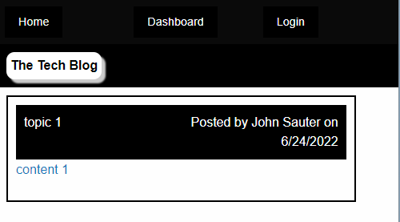

# Tech Blog

## Description

A CMS-style blog similar to a Wordpress site where you can
initiate discussion topics and comment on them

## Table of Contents

- [Installation](#installation)
- [Usage](#usage)
- [License](#license)

## Installation

git clone https://github.com/JohnSauter/UNH_Bootcamp-14-Tech_Blog.git
cd UNH_Bootcamp-14-Tech_Blog
npm install

## Usage

node server.js runs the server locally.  Connect to http://localhost:3001.

You can browse current topics without logging in.
If you wish to contribute, create an account.
You can return later and log in to continue a discussion.

## License
GNU AGPLv3

## Features

Unauthenticated users can read but not comment or
initiate new topics.

## Screenshot

## Deployed Applicationn

https://damp-sea-07082.herokuapp.com/

## Questions

If you have any questions, contact me.
My e-mail address is John_Sauter@systemeyescomputerstore.com.
My github user name is JohnSauter.  See my profile at
https://github.com/JohnSauter.

